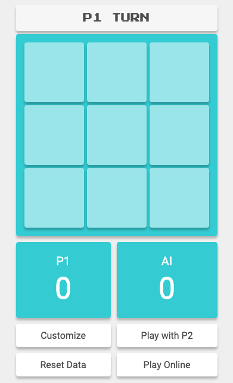

# _Tic-tac-toe_ Game

Developer: Jeff Ou  
Main goal: Make a fancy tic-tac-toe game using all of my knowledge about web development

# MVP - Bronze

## Technologies

- **Webpack**: to combine multiple JS files into one JS file 'main.js'
- **Sass**: improves the workflow and efficiency of CSS development, also combines multiple CSS files into one CSS file 'main.css'
- **Figma**: Design [UI wireframes](https://www.figma.com/file/pONrt65x6N0M6ISI2OpVKh/Tic-Tac-Toe-UI-Design?node-id=6%3A40&t=g5C6NvLxxihRRiIy-1)

## User stories

- As a player, I should be able to start a new tic-tac-toe game ✅
- As a player, I should be able to click on a square to add X first and then O, and so on ✅
- As a player, I should be shown a message after each turn for if I win, lose, tie or whose turn it is next ✅
- As a player, I should not be able to click the same square twice ✅
- As a player, I should be shown a message when I win, lose or tie ✅
- As a player, I should not be able to continue playing once I win, lose, or tie ✅
- As a player, I should be able to play the game again without refreshing the page ✅

## [UI Wireframe](https://www.figma.com/file/pONrt65x6N0M6ISI2OpVKh/Tic-Tac-Toe-UI-Design?node-id=0%3A1&t=ZF6JZwuBHaZpcvQp-1)


## Bronze Pseudocode

### HTML:

- Create a div to represent the board
  - Add class 'board'
- Create 9 div inside of the board to represent the cells
  - Add a unique id to each div: 1 to 9
  - 
  - Add a class 'cell' to each div
- Create a header for the title 'Tic-Tac-Toe'
- Create a 'Play game' button
  - Add class 'resetGameButton'
- Create a div to display a message
  - Add class 'message'

### CSS:

- Use Grid to layout cells to make a 3 x 3 Board
- Add accent color to the 'Play game' button
- Add a hover effect on the 'Play game' button
- Add a click effect on the 'Play game' button

### JS:

#### Create [a Game class](./src/Game.js) with the following private instance variables:

- board: an empty object to represent the 3 x 3 board, where the key represents the position of the marked cell and the value represents the player; ex: `{1: 'O', 2: 'X', ...}`.
- player1 and player2: strings representing the markers for each player.
- whoseTurn: a string representing the current player's marker, with a default value of player1.
- winningCombination: an array containing 8 sub-arrays, each representing a possible winning combination in the game. Each sub-array contains 3 values that represent the positions of the cells that need to be marked in order to win; ex: `[[1,2,3], [4,5,6], ...]`.

#### The Game class should also have the following public instance methods:

- checkGameOver(positionOfMarkedCell: number): string: a method that checks if the game is over after a player marks a cell. It takes a number representing the position of the newly marked cell and returns a message indicating the winner of the game, a tie, or that the game is not over. The method does the following:
  - Switches turn to the next player.
  - Saves the player and position of the marked cell to the board.
  - Checks if there is a winning, losing, or tie condition based on the current state of the board and return the appropriate message.
- resetBoard(): void: a method that resets the game board by emptying the board object and clearing any messages and marked cells.

#### Add the following event listeners to the UI:

- A click event listener to the .resetGameButton element that reset the game.
- A click event listener to the .board element that calls the checkGameOver method of the current Game instance and updates the UI accordingly.

# MVP - Silver

## User stories (include Pseudocode)

<details>
  <summary>As a player, I want to keep track of multiple game rounds so that I can see how many times I have won, lost, or tied, and keep track of my progress in the game. ✅</summary>

### Pseudocode

#### HTML:

- Create a header element
  - Create a scoreboard element
  - Include the title element

#### JS:

- Add **player1WinCount** and **player2WinCount** private instance variables to the _Game_ class
- Update the scoreboard after any player win
</details>

<details>
<summary>As a player, I want to be able to customize my game token (X, O, name, picture, etc.) so that I can personalize my gaming experience and make it more enjoyable. ✅</summary>

### Pseudocode

#### HTML:

- create a form element
  - create a text input for a name
  - create a text input for a marker
  - create a file input for uploading an image
  - create a button to submit the change

#### JS

- update name, marker and image in UI
- update name, marker and image in the player instance

</details>

<details>
<summary>As a player, I want my game data to be saved locally using localStorage so that I can continue playing even if I lose internet connectivity or refresh the page. ✅</summary>
</details>
<details>
<summary>As a player, I want audio to be included in the game so that I can have an immersive and enjoyable gaming experience. ✅</summary>
</details>
<details>
<summary>As a player, I want to be able to play against an AI opponent that is programmed to play an unbeatable game so that I can challenge myself and improve my skills. ✅</summary>

### Pseudocode

#### JS:

- How does AI mark the cell?

```
 WHEN it is AI's turn
  prevent player from marking cell
  complete the turn
  switch turn
```

- How does AI select the cell?

```
  IF AI plays second
    IF it is AI's first turn
      IF center cell is marked
        select corner cell
      ELSE
        select center cell
    ELSE
      block any potential winning combination made by human OR
            FOR each winning combination in the game:
              IF the combination has two cells filled by the human and one empty cell:
                select the empty cell
      select any potential winning combination OR
            FOR each winning combination in the game:
              IF the combination has two cells filled by the AI and one empty cell:
                select the empty cell
      randomly select empty cell
  IF AI plays first
    SET winning = false
    SET previousMove;
    IF it is AI's first turn
      select center cell
    ELSE
      block any potential winning combination made by human OR
      select any potential winning combination OR
      If corner cells are unmarked and !winning
        SET winning = true
        If humanMove === 2 or humanMove === 8
          select 4
          SET previousMove = 4
        ELSE IF humanMove === 4 or humanMove === 6
          select 2
          SET previousMove = 2
      ELSE IF winning
        IF previousMove === 4
          select 7
        ELSE
          select 1
      ELSE
        randomly select empty cell
```

</details>

<details>
    <summary>As a player, I want the game to be fully responsive so that I can play it on my mobile phone without any issues, and I want the styling to be creative and engaging, using hover effects or animations to enhance the gaming experience. ✅</summary>
</details>

## [UI Wireframe](https://www.figma.com/file/pONrt65x6N0M6ISI2OpVKh/Tic-Tac-Toe-UI-Design?node-id=6%3A40&t=g5C6NvLxxihRRiIy-1)


# MVP - Gold

## Technologies

- Express.js
- Socket.io
- Heroku
- Nodemon

## User stories

- As a player, I want to be able to play the game online with another player
  - As a player, I can join a room to play with another player ✅
  - As a player, I'm not able to mark until it is my turn ✅
  - As a player, my board should be synced with my opponent's ✅
  - As a player, the game should be automatically reset after the game is over and switch sides ✅
  - As a player, I should able to see the opponent's name, score and marker. ✅
  - As an admin, I want each room can only contain at most 2 players ✅

# Final UI

### Desktop Screen


### Mobile Screen (smaller than 601px)



# TODO

1. add page title and icon ✅
2. create folders to organize files ✅
3. add global scoreboard
4. fix tieGameSound load error on production ✅
5. add a footer that includes GitHub repo, LinkedIn and copyright
6. testing what happen if there is more than one room

# Hurdle

1. refactor code - GameUI and Game => Game, Player and GameUI
