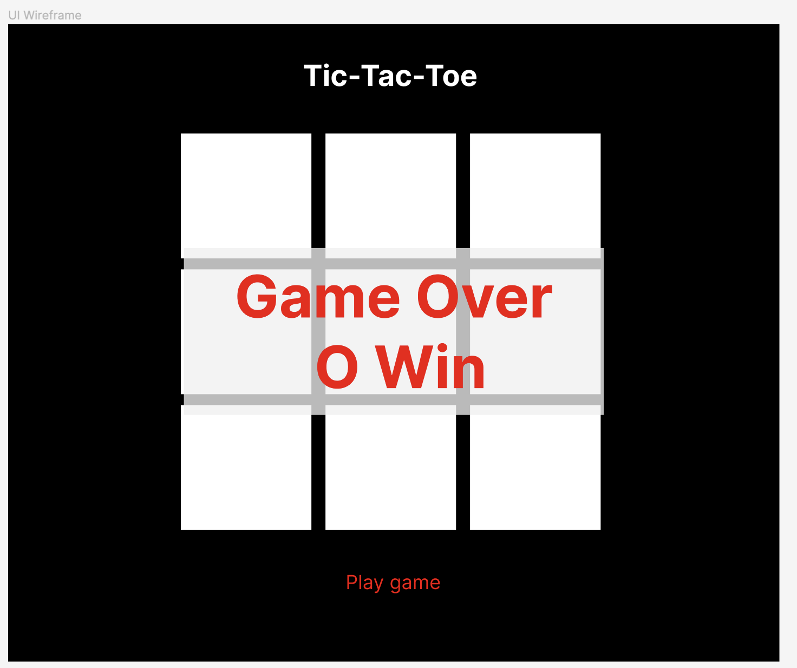

# _Tic-tac-toe_ Game

Developer: Jeff Ou  
Main goal: Make a fancy tic-tac-toe game using all of my knowledge about web development

# MVP - Bronze

## User stories

- As a user, I should be able to start a new tic-tac-toe game
- As a user, I should be able to click on a square to add X first and then O, and so on
- As a user, I should be shown a message after each turn for if I win, lose, tie or whose turn it is next
- As a user, I should not be able to click the same square twice  
  As a user, I should be shown a message when I win, lose or tie
- As a user, I should not be able to continue playing once I win, lose, or tie
- As a user, I should be able to play the game again without refreshing the page

## UI Wireframe

## Tech

- **Webpack**: to combine multiple JS files into one JS file 'main.js'
- **Sass**: improves the workflow and efficiency of CSS development, also combines multiple CSS files into one CSS file 'main.css'
- **Figma**: Design [UI wireframe](https://www.figma.com/file/pONrt65x6N0M6ISI2OpVKh/Tic-Tac-Toe-UI-Design?node-id=0%3A1&t=ZF6JZwuBHaZpcvQp-1)

## Bronze Pseudocode

### HTML:

- Create a div to represent the board
  - Add class 'board'
- Create 9 div inside of the board to represent the cells
  - Add a unique id to each div: 1 to 9
  - Add a class 'cell' to each div
- Create a header for the title 'Tic-Tac-Toe'
- Create a 'Play game' button
  - Add class 'playGameButton'
- Create a div to display a message
  - Add class 'message'

### CSS:

- Use Grid to layout cells to make a 3 x 3 Board
- Add accent color to the 'Play game' button
- Add a hover effect on the 'Play game' button
- Add a click effect on the 'Play game' button

### JS:

- Create a 'Game' class
  - private instance variable 'board' empty object to represent the 3 x 3 board
    - the key represents the position of the marked cell and the value represents the player; ex: `{1: 'O', 2: 'X'...}`
  - private instance variables player1 as "X" and player2 as "O"
  - private instance variable whoseTurn
    - default value: player1
  - private instance variables winningCondition array
    - Contain 8 arrays and each array contains 3 values to represent all possible combinations in placing three of their marks in a horizontal, vertical, or diagonal row; ex: `[[1,2,3], [4,5,6]...]`
  - public instance method checkGameOver(clickedCell: number)
    - update whoseTurn variable
    - update the corresponding cell of clickedCell in the board variable
    - check if there is a winning, losing or tie condition by comparing the board variable with winningCondition variable
    - display winning, losing, tie or whose turn message
  - public instance method startNewGame
    - empty the board object
    - clear message and marked cells
- Add click event listener to the '.playGameButton' element
  - call startNewGame
- Add click event listener to the '.board' element
  - call checkGameOver(clickedCell)
  - fill the clicked cell with "O" or "X" based on whose turn

# MVP - Sliver

# MVP - Gold
